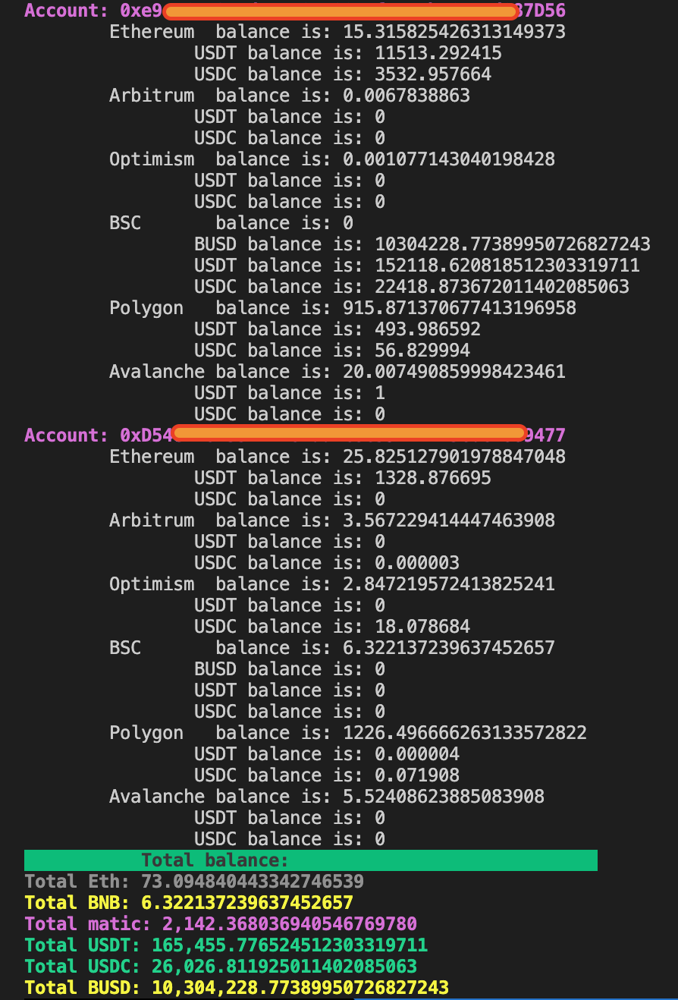

# Balance checker

The script checks the balance in networks (*Ethereum, Arbitrum, Optimism, BSC, Polygon, Avalanch*) , as well as the number of USDT and USDC in the same networks. At the end, the total number of coins on all accounts will be displayed.

## configure 

Open **balance_checker.ini** and at the bottom and add you addresses to *addresses* section, each address should be in quotation marks and go through a comma. 

##### examples:
for only one address:

    [accounts]
    addresses = ["0xe9e7_bla_bla_bla_D56"]

for more than ane address:

    [accounts]
    addresses = [
	    "0xe9e7_bla_bla_bla_D56",
	    "0xe3c7_bla_bla_bla_c45",
	    "0xh1c7_bla_bla_bla_c71"]

  

## System requirements

Can be run on Mac OS, Windows or Linux. Python 3.8+, pip and all nessesary modules must be installed.

## Donation
You  can say *Thank you!* by donation:

**USDT TRC20** - ***TKiYgCkVEzJkQbSkt8ZGx7nxpe2VUS1YGy***
other coins you can send to MetaMask address 
***0x6c433CeAf8a10a3E6725E566ad63A0eaA6c99298***
any PR and Issues are welcome!

## Output

## Known issues

Script can be down because of using public RPC. Just re-run =)
